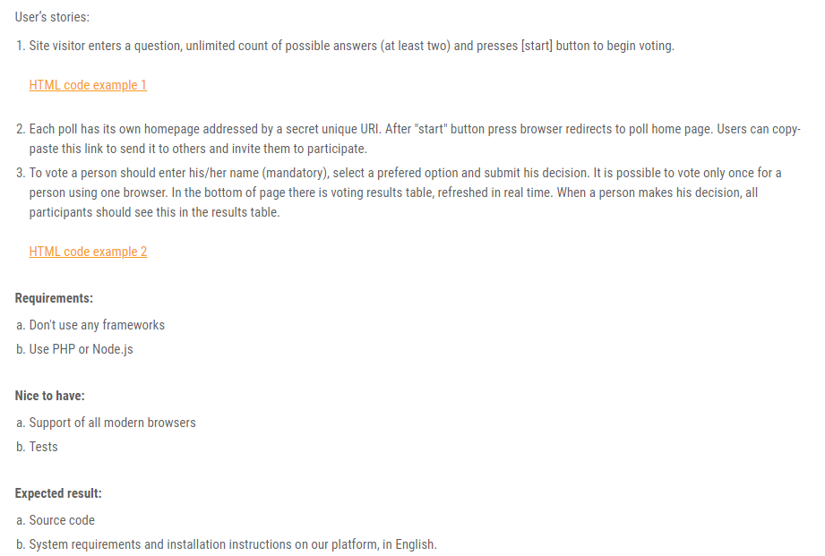
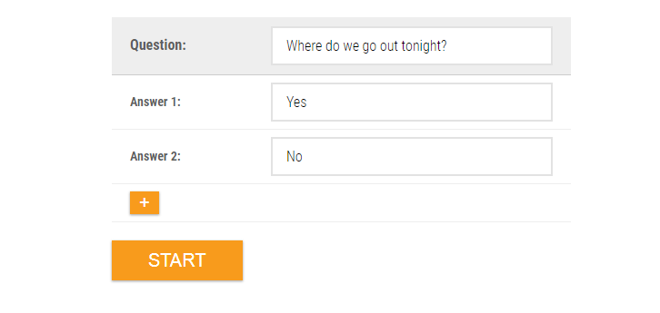
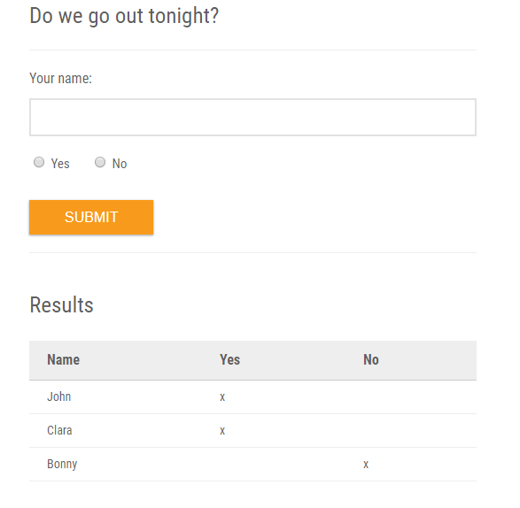

# Online poll
This is a **poll** that corresponds the requirements of the task **shown below**



HTML code example 1


HTML code example 2


## Introduction
Online poll based on Node.js and WebSockets **without any frameworks**.

## Requirements
- [Node.js](https://nodejs.org)
- [MySQL](https://www.mysql.com)

## Install
Just a few steps to install:
1. Customize file *./setup/db-settings.js* 
2. Run this commands:
```bash
$ npm install
$ node setup/create-db
$ node setup/create-tables
$ node setup/add-foreign-keys (optional)
```

## Run
Only one command to run:
```bash
$ node server
```
Server works on port 4000